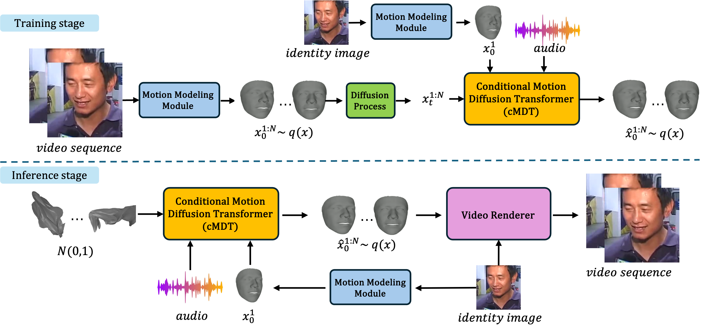

# AI Killed the Video Star

The the code for the papers AI Killed the Video Star and Dimitra: Audio-driven Diffusion model for Expressive Talking Head Generation

[Paper](http://arxiv.org/abs/2502.17198) | [Project Page](https://tashvikdhamija.github.io/dimitra/)




With this code can animate face image based on an audio sequence to do talking head generation

---

## Installation

Follow these instruction to install the code. It will require a NVIDIA gpu with more than 8 Go of memory.

```bash
git clone https://github.com/TashvikDhamija/dimitra.git
cd dimitra
pip install -r requirements.txt
cd Deep3DFaceRecon_pytorch
git clone -b 0.3.0 https://github.com/NVlabs/nvdiffrast
cd nvdiffrast
pip install .
cd ../../
mv utils.py YOURVENV/lib/python3.12/site-packages/realesrgan/
mv degradations.py YOURVENV/lib/python3.12/site-packages/basicsr/data/
```
Then download the weights from [link](https://drive.google.com/drive/folders/1s48upUFKcO1iVe83tiUNgDe2k0oPeHfZ?usp=sharing) an copy the content in the directory

If there are issues with packages versions try:
```bash
pip install -r requirements_noversions.txt
```

## Inference instructions

To run a single time in 512*512 resolution use 

```bash
python scripts/run_single.py --input_dir INPUTDIR --output_dir OUTPUTDIR
```

To run a single time in 256*256 resolution use 

```bash
python scripts/run_single.py --input_dir INPUTDIR --output_dir OUTPUTDIR --res 256
```
To run a single time and clean the output video from artifacts (slower that normal generation) use

```bash
python scripts/run_single.py --input_dir INPUTDIR --output_dir OUTPUTDIR --remove_artifacts
```

The results will be saved in the directory you choose as Dimitra_output.mp4 (and Dimitra_output_cleaned.mp4 if removing artifacts)
In the input directory the following configuration are valid:
- 1 .mp4 file (video recontruction from the audio)
- 2 .mp4 files (the first aphabeticaly will be used for identity and teh second for audio)
- 1 .png file and 1 .wav file
- 1 .mp4 file and 1 .wav file
- 1 .png file and 1 .mp4 file

To run inference on multiple video use (options are the same as above)
```bash
python scripts/run_multi.py --input_dir INPUTDIR --output_dir OUTPUTDIR
```
The output directory will have the same structure as the input directory.
This support the same configuration as above (in sevreal subdirectories) in addition to the following one:
- more than 2 .mp4 file (reconstruction for entire dataset)
- more than 1 .mp4 and 1.png file (several audio same identity)
- more than 1 .wav and 1.png file (several audio same identity)
- more than 1 .wav and 1.mp4 file (several audio same identity)
- more than 1 .mp4 and 1.wav file (several identity same audio)
- more than 1 .png and 1.wav file (several identity same audio)
- more than 1 .png and 1.mp4 file (several identity same audio)


## Training instructions
Training code coming soon


## Acknowledgement
This code reuse code or part of code provided by:

3DMM extraction:
[https://github.com/sicxu/Deep3DFaceRecon_pytorch](https://github.com/sicxu/Deep3DFaceRecon_pytorch)

Video renderer:
[https://github.com/RenYurui/PIRender](https://github.com/RenYurui/PIRender)
[https://github.com/FuxiVirtualHuman/styletalk](https://github.com/FuxiVirtualHuman/styletalk)

Artifact removing:
[https://github.com/wzhouxiff/RestoreFormerPlusPlus](https://github.com/wzhouxiff/RestoreFormerPlusPlus)

## References

If you use our code please cite:
```bash
@article{chopin2025dimitra,
  title={Dimitra: Audio-driven Diffusion model for Expressive Talking Head Generation},
  author={Chopin, Baptiste and Dhamija, Tashvik and Balaji, Pranav and Wang, Yaohui and Dantcheva, Antitza},
  journal={arXiv preprint arXiv:2502.17198},
  year={2025}
}
```
